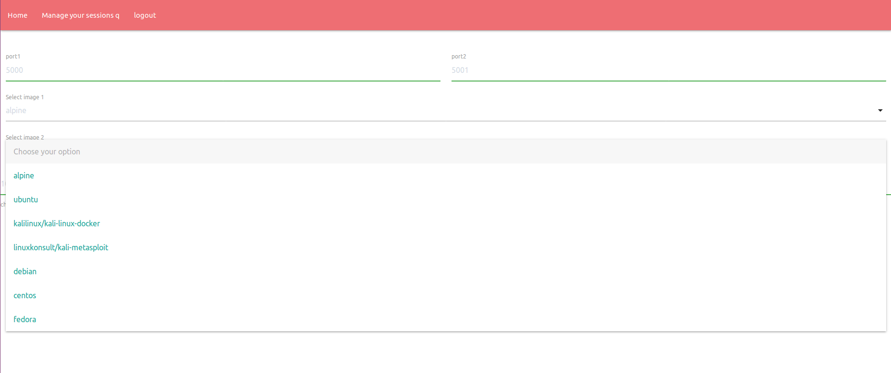
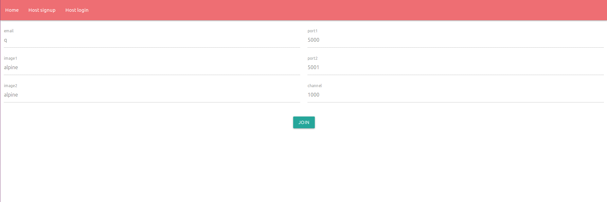
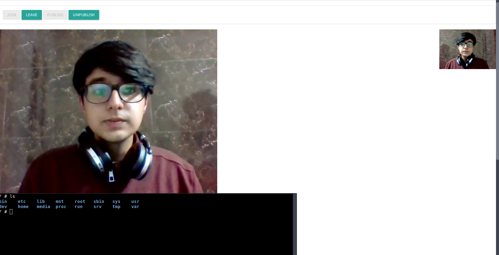
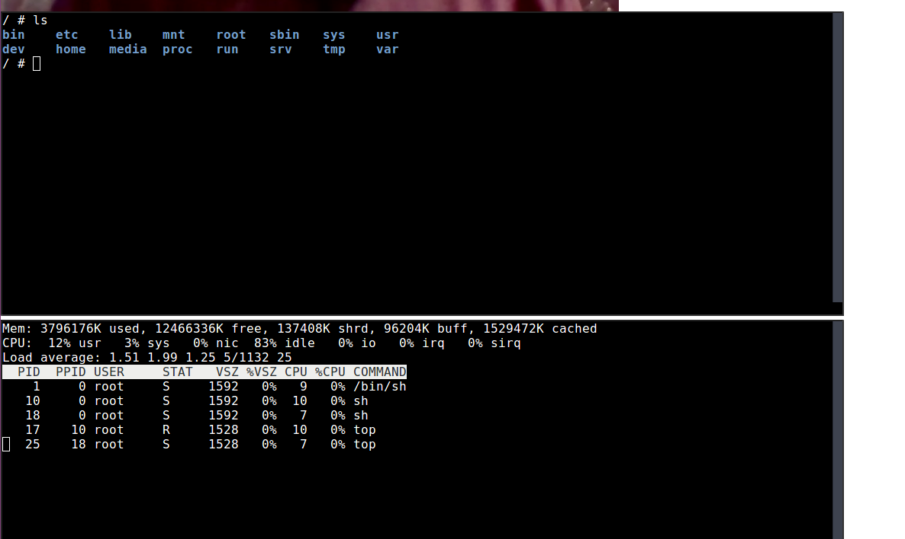
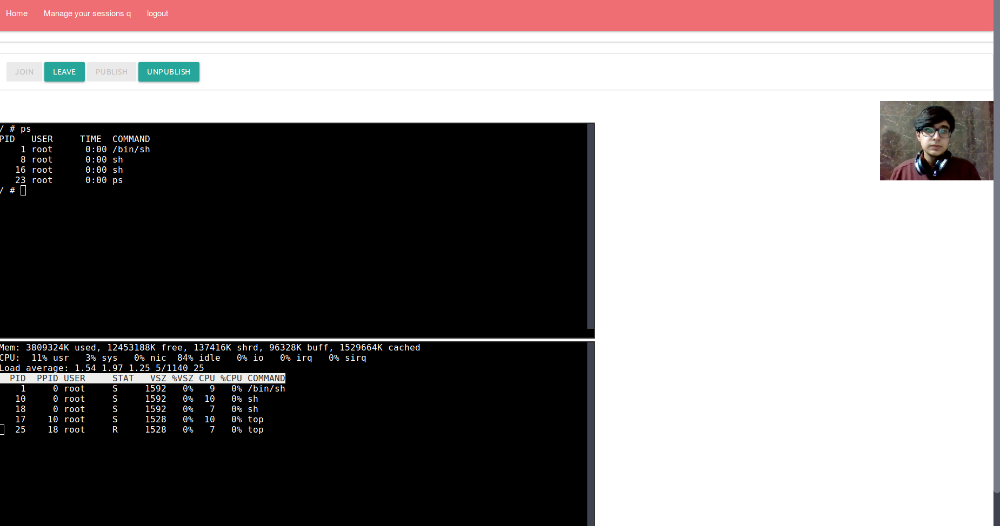

# Examinaar

Shared Terminal RTC. 
Multiple shared web terminals along with web RTC for CEH/Comptia+/RHCE/RHCS/LFCE/LFCS exam aid

<br />
<br />


### Steps to run

<br />

* Make sure you have [go](https://golang.org/dl/) and [docker](https://get.docker.com/) installed

<br />

* Its good to pull the follwing images from dockerhub before proceeding: alpine, ubuntu, debian, kalilinux, centos, fedora

<br />

* Clone the project and navigate into it

<br />


```
go get github.com/yudai/gotty
go get github.com/mattn/go-sqlite3
go get github.com/gorilla/sessions
go run main.go
```

<br />
<br />


* Choose your own OS as your exam environment


* View and join active sessions


* Live video calling and monitoring


* Shared terminals between examiner and student


* Host and student abstraction


* Manage your sessions easily 


* No memory leaks, mutually exclusive sessions

<br />

<br />

<br />




<br />

<br />



<br />

<br />



<br />

<br />



<br />

<br />



<br />

<br />


<br />
